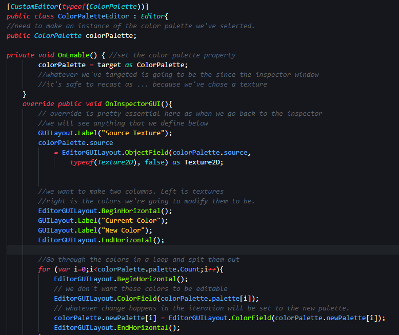
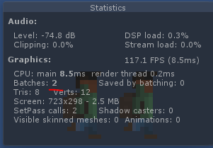
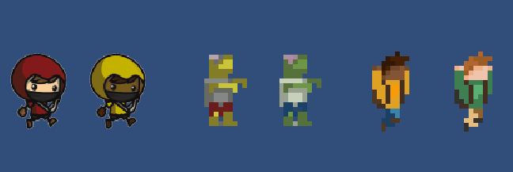

# Palette-Swapping
Basic palette swapping script. Only slightly optimized. Made for learning.
**Reader beware: The following README were written as notes and not written as an actual official README document.

<table>
  <tr>
    <td></td>
    <td>Sampling colors out of the texture, we'll be working from the uppermost point of the texture and working our way to the right and then down and to the right through all of the pixels of the artwork. Since we're putting the color texture information at the top, this will be the first thing we'll read, and it'll help speed up when we start to build out our color palettes. Also because we have Padding and Offset between each of our sprites, this will never show up inside of our sprites. </td>
  </tr>
</table>

This isn’t the first time I’ve seen** ScriptableObject **used. I don’t recall where the first time I saw it was, but the essential takeaway from the first lesson is that we’re going to use this inheritance to make a menu item to create a color palette. A texture being used in this example should have no **Compression **in order to avoid having an excess of colors in each palette. 

# Scriptable Object

Currently, our script looks at whatever object is selected when you click the menu item we created, checks to see if it’s a Texture, and then prints to the console if it can or cannot create a color palette. The next steps are going to be to actually create the palette. 

<table>
  <tr>
    <td>ColorPalette.cs</td>
  </tr>
  <tr>
    <td></td>
  </tr>
</table>

<table>
  <tr>
    <td>CustomAssetUtil.cs
CreateAsset<T>(string path)  _ 
does not inherit from anything. 
Whatever public static T is (type?) then create a type of scriptable object. 
Call it ‘asset’
Utilize AssetDatabase!! 
CreateAsset
SaveAssets
GetAssetPath
Replace assetpath
Return asset .
</td>
    <td>ColorPalette.cs
Serializable 
Menu item
 CreateColorPalette() _ 
If the selected obj is a texture
CustomAssetUtil.CreateAsset
<ColorPalette>(selectionPath)
Once done, you can select the newly created ColorPalette asset and modify any of its public properties. 😁</td>
  </tr>
</table>

<table>
  <tr>
    <td></td>
  </tr>
</table>

You really want to prepopulate any new object as much as possible. 

We pass a reference to the selected texture into *public* *Texture2D* source; by passing in the selected texture into the newPalette’s ** List<Color>** source.

In order to do more advanced scripting to the texture, it must be read/write enabled in its advanced options. We’re going to use a method in texture class called **GetPixels();**

At the moment what the code fully does is create a color palette based on the selected texture. The **_foreach_****_ _**loop in the *List*<*Color*> BuildPalette(*Texture2D* texture) function goes through every **color **inside the variable **colors ****_=_**** ****texture****.****GetPixels****();**, checks to see if the color has an alpha channel, and then adds it to the  *=* *new* *List*<*Color*>() called **palette **using the add function palette.Add(color);

None of this happens until we call **newPalette****.****ResetPalette****();** which sets the palette to the result of the **BuildPalette** function, and populates the **newPalette **with the palette that is **return**ed the **BuildPalette **function.  I believe the idea behind **ResetPalette** is to make it so that you can create a brand new palette without adding to the palette. 

<table>
  <tr>
    <td>The Code</td>
  </tr>
  <tr>
    <td>   public static void CreateColorPalette(){
       if (Selection.activeObject is Texture2D)-------------------------------{
   var selectedTexture = Selection.activeObject as Texture2D;
   var selectionPath = AssetDatabase.GetAssetPath(selectedTexture);
       selectionPath = selectionPath.Replace(".png", "-color-palette.asset");
   var newPalette = CustomAssetUtil.CreateAsset<ColorPalette>(selectionPath);
           newPalette.source = selectedTexture;
           newPalette.ResetPalette();
           Debug.Log("Creating a Palette");   } else {
           Debug.Log("Can't create a Palette. Select a Texture2D");-----}---}
   public Texture2D source;
   public List<Color> palette      = new List<Color>();
   public List<Color> newPalette   = new List<Color>();
   private List<Color> BuildPalette(Texture2D texture){
   List<Color> palette             = new List<Color>();
   var colors                      = texture.GetPixels();
   foreach (var color in colors) {
           if (!palette.Contains(color)) {
               if(color.a == 1) { palette.Add(color);-------------------}--}--}                           
           return palette;----------------------------------------------------}
   public void ResetPalette()-------------------------------------------------{
       palette = BuildPalette(source);
       newPalette = new List<Color>(palette);---------------------------------}
</td>
  </tr>
</table>

## Custom Editor

The custom editor must be defined similarly to the way you defined serialized variables. Inside straight brackets. Only this editor takes the extra parameter (typeof()) which in this case is our class, the **ColorPalette**. 

<table>
  <tr>
    <td>EditorGUILayout.BeginHorizontal();
GUILayout.Label("Current Color");
GUILayout.Label("New Color");
EditorGUILayout.EndHorizontal();
</td>
    <td></td>
  </tr>
</table>

With the current version of the Editor script I’m writing inside of ColorPalette.cs, we are editing the **EditorGUILayout **to create two columns and populate the palettes.

## Saving Scriptable Object Data

**The problem: **

Currently, when we stop running the game, all of the palettes that we create are reset and emptied. So in order to solve this, we need to save all of our scriptable object data that we are getting from the texture; in this case, the palette info. 

We are going to resolve this using an **EditorUtility**** **method called **SetDirty**(); and pass in the **colorPalette **we created. 

NOTE:

We extend Monobehavior when we’re attaching a script to a unity Game Object

## Cloning a Texture

The primary function inside **PaletteSwapper.cs **is **SwapColors() **which takes in the color palette from the texture we have cached. It checks to see if the texture is empty, then sets it to the selected texture. This texture is cloned, its default settings are defined, and the colors are set using a for loop which fills out all available unique colors in the array with the colors in the texture. PaletteSwapper.cs is also where the MaterialPropertyBlock is defined and the texture is set within which is later used to ensure the animation is updated with whatever the current color is.

<table>
  <tr>
    <td>void SwapColors(ColorPalette palette)------------------------------{
      if (palette.cachedTexture == null)------------------------{
           texture = spriteRenderer.sprite.texture;
           var w                   = texture.width;
           var h                   = texture.height;
           var cloneTexture        = new Texture2D(w, h);
           var colors              = texture.GetPixels();
           cloneTexture.wrapMode   = TextureWrapMode.Clamp;
           cloneTexture.filterMode = FilterMode.Point;
           for (int i=0; i< colors.Length; i++)--------------{
               colors[i] = palette.GetColor(colors[i]);------}
           cloneTexture.SetPixels(colors);
           cloneTexture.Apply();
           palette.cachedTexture = cloneTexture;----------------}
       block = new MaterialPropertyBlock();
       block.SetTexture("_MainTex", palette.cachedTexture);--------}
</td>
  </tr>
</table>

## Replacing Animation Texture

This is going to handle animations.

**MaterialPropertyBlock **was created here in this lesson. *See **[additional note*s](#heading=h.qk9v9wt36nqk)* below*

<table>
  <tr>
    <td>// this gets reset on every update call I think
   private void LateUpdate()-------------------------------- {
       // setting the property block to the block we
       // created at the end of the start function
       spriteRenderer.SetPropertyBlock(block);---------------}
It's important because on the next update, the animation may change and we need to give it a new reference to the cloned texture we're using.
</td>
  </tr>
</table>

## Swapping Colors on a texture

Now we're gonna need a way to remap the default color in the texture to the new color that we supply in the color palette. To do this, let's open up our Scripts folder and select our color palette script. Here, we're gonna create a new method inside of our color palette class that'll allow us to get the color that we wanna replace. Let's scroll down, and below where we reset our palette let's add a new public property. And, this public property's gonna return a color. And, let's give it the name Get Color.

<table>
  <tr>
    <td>Now, as we iterate through each of the colors we're asking the palette to get us the color and if there's a match for new color it'll return the new color instead.</td>
  </tr>
  <tr>
    <td>for (int i=0; i< colors.Length; i++){
           colors[i] = palette.GetColor(colors[i]);           }
</td>
  </tr>
</table>

At this point, due to some of the things we're referencing, we won't actually be able to compile this into a final game.

## Ch 6 Optimizing

16:40

## Compiler Conditions

Unity Editor is special in that you can only use it inside of the Editor itself. If you try to compile with using references to Unity Editor, it's going to throw this error.

Fixed by using 

 [_](https://docs.unity3d.com/Manual/PlatformDependentCompilation.html) #*if* UNITY_EDITOR     #*endif*     

Anywhere that the unity editor is referenced. See code for example. It’s pretty obvi.

## Optimizing the Draw Calls

We want to resolve the problem of multiple draw calls for each instance of the same texture. And we will.

We create a new public property to allow us to cache a texture.

I moved quite a few things around. Review the code and the video. 

NullReferenceException: Object reference not set to an instance of an object

PaletteSwapper.SwapColors (ColorPalette palette) (at Assets/Scripts/PaletteSwapper.cs:29)

PaletteSwapper.Start () (at Assets/Scripts/PaletteSwapper.cs:23)

 ✅ palette.cachedTexture *=* cloneTexture;

## Cleaning up artwork Colors

Open the PNG in Photoshop

Magic Wand Select - tolerance 0, AA off, not continuous

Alt+Backspace or something to magic fill from the color selected.

Save for web -> Colors -> 16bit -> Press down to see how many colors you’re at.

## Additional Notes

* **Platform dependent compilation** - Consists of preprocessor directives that partition scripts to compile and execute exclusively for the supported platform specified by the #define directive. In our case we used #UNITY_EDITOR.

*  **SetDirty()**** **- **Unity Editor -> **Classes -> Editor Utility -> SetDirty 

Sets the object to mark as dirty. What does this mean? Unity uses the dirty flag internally to find changed assets that must be saved to disk.

* **Material Property Block **- **Unity Engine -> **Classes. 
A block of material values to apply. Use it in situations where you want to draw multiple objects with the same material, but slightly different properties. 

* **Serializable - Other -> **Classes 
The Serializable attribute lets you embed a class with sub-properties in the inspector. 

**Currently **getting 6 batch draw calls when it should only be three. Review [Optimizing Draw calls](#heading=h.kjvlxc6g83uq)

The reason 6 batch draw calls are being made is because each new color palette creates a new version of this texture. This is fine. The idea behind optimizing the batch calls for any particular texture is to save on batch calls when the same character is being repeated. 

